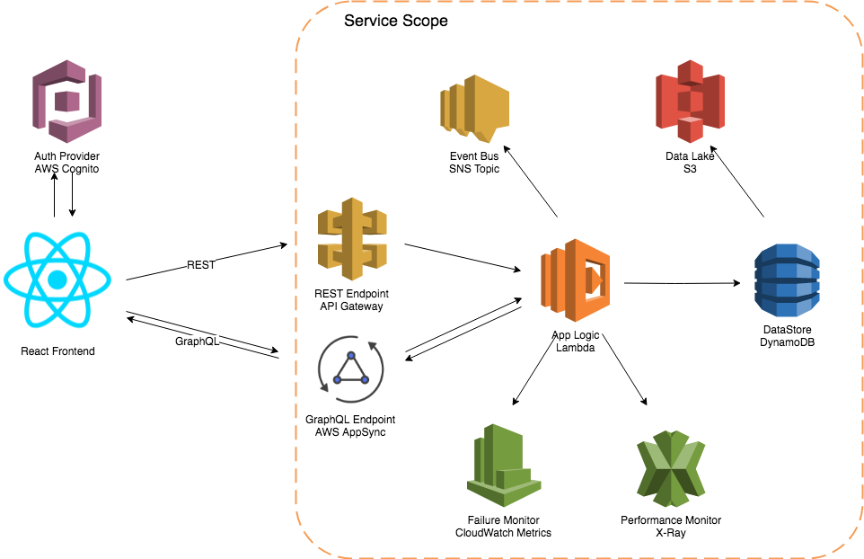

# Shopping Cart Prof of Concept

POC of Shopping Cart using microservices on AWS

## Functionalities

The service will be responsible for the folowing Shopping Cart functionalities:

- Add Product to Shopping Cart;
- Update Product Quantity in the Shopping Cart;
- Remove Product from Shopping Cart;
- Convert Unauthenticaed User Shopping Cart's to Authenticated User Shopping Cart;
- Remove All products of Shopping Cart;

## Architecture

 

The service will provide REST and GrapQL endpoints to perform his functionalities based on a defined [API contract](ShoppingCatAPI.yaml) and [GraphQL schema](ShoppingCartSchema.graphql).

### Service Components

#### Integration Layer

- **REST API Endpoint**: API endpoint that provides access to REST API's. This implementation will use Amazon API Gateway.
- **GraphQL Endpoint**:GraphQL endpoint to provide access to query, mutations and subscriptions. This implementation will use AWS AppSync.
- **Event Publisher**:Component responsible for emit business events related to the service. This implementation will use Amazon SNS Topic.

#### Application Layer

- **Application Logic**: Component responsible for perform Shopping Cart logic and internal service orchestration. This implementation will use AWS Lambda using Node.js Runtime.

#### Persistence Layer

- **DataStore**: Component responsible for data persistence. This implementation it will use Amazon DynamoDB.
- **Data Lake**: Component responsible for historical persistence and event sourcing data for the Shopping Cart. This implementation will use DynamoDB streams and S3 buckets.

#### Management Layer

- **Failure Monitor**: Component responsible for observability of the internal service integration. This component will work as a signal of integration problems ocurred in the service. This implementation will use AWS Cloudwatch Metrics.

- **Performance Monitor**: Component responsible for observability of internal service integration in a performance perspective. This component will provide response time and performance observability. This implementation will use AWS X-Ray.

### External Components

#### Authentication Provider

Component responsible for management of user pools and user authentication. This implementation will be used Amazon Cognito User Pools.

### Business Assumptions

The service was designed with the folowing business assumptions in mind:

- For the authenticated users, the shopping cart will be shared across all user devices;
- For the Unauthenticated user, the frontend will manage the session Id and provided it to backend;
- When the user proceeds with the Purchase, the frontend will be responsible for Shopping Cart clearance;

### Integration Requirements

- For authenticated users, the HTTPS requests must contains an Authorization Header with a JSON Web Token with authentication details;
- For unauthenticated users, the frontend session number must be informed as a path parameter of the request. The Path parameter in question must have a format that are agreed before and this format will be validated by the service logic to garantee that it can't conflict with the user identification range.