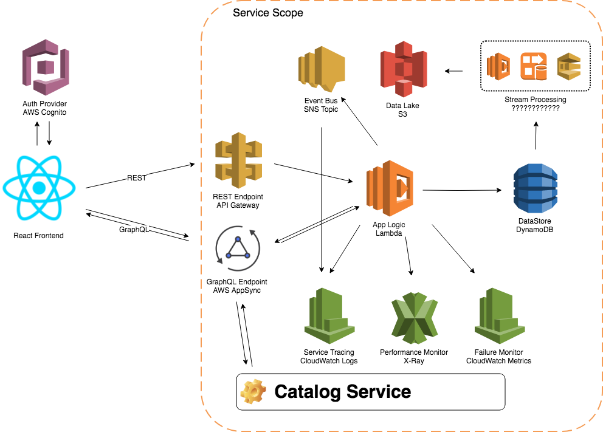

# Shopping Cart Proof of Concept

POC of Shopping Cart using microservices on AWS

## Functionalities

The service will be responsible for the folowing Shopping Cart functionalities:

- Add Product to Shopping Cart;
- Update Product Quantity in the Shopping Cart;
- Remove Product from Shopping Cart;
- Convert Unauthenticaed User Shopping Cart's to Authenticated User Shopping Cart;
- Remove All products of Shopping Cart;

## Architecture

 

The service will provide REST and GrapQL endpoints to perform his functionalities based on a defined [API contract](ShoppingCartAPI.yaml) and [GraphQL schema](ShoppingCartSchema.graphql).

### Service Components

#### Integration Layer

- **REST API Endpoint**: API endpoint that provides access to REST API's. This implementation will use Amazon API Gateway.
- **GraphQL Endpoint**:GraphQL endpoint to provide access to query, mutations and subscriptions. This implementation will use AWS AppSync.
- **Event Publisher**:Component responsible for emit business events related to the service. This implementation will use Amazon SNS Topic.

#### Application Layer

- **Application Logic**: Component responsible for perform Shopping Cart logic and internal service orchestration. This implementation will use AWS Lambda using Node.js Runtime.

#### Persistence Layer

- **DataStore**: Component responsible for data persistence. This implementation it will use Amazon DynamoDB.
- **Stream Processing**: Component responsible for process data streams from DynamoDB and persist on Data Lake. There are a few options for the implementation of this component. We must choosed based on our expected data volume. For the POC we can use SQS queues and test the service operation with an expected transaction volume.
- **Data Lake**: Component responsible for historical persistence and event sourcing data for the Shopping Cart. This implementation will use DynamoDB streams and S3 buckets.

#### Management Layer

- **Failure Monitor**: Component responsible for observability of the internal service integration. This component will work as a signal of integration problems ocurred in the service. This implementation will use AWS Cloudwatch Metrics.

- **Performance Monitor**: Component responsible for observability of internal service integration in a performance perspective. This component will provide response time and performance observability. This implementation will use AWS X-Ray.

- **Service Tracing**: Componente responsible to log and trace service operations. This componenet will concentrate all the operations performed by each of the other componentes of the service. This implementation will use Cloudwatch Logs.

### External Components

#### Authentication Provider

Component responsible for management of user pools and user authentication. This implementation will be used Amazon Cognito User Pools.

### Business Assumptions

The service was designed with the folowing business assumptions in mind:

- For the authenticated users, the shopping cart will be shared across all user devices;
- For the Unauthenticated user, the frontend will manage the session Id and provided it to backend;
- When the user proceeds with the Purchase, the frontend will be responsible for Shopping Cart clearance;

### Integration Requirements

- For authenticated users, the HTTPS requests must contains an Authorization Header with a JSON Web Token with authentication details;
- For unauthenticated users, the frontend session number must be informed as a path parameter of the request. The Path parameter in question must have a format that are agreed before and this format will be validated by the service logic to garantee that it can't conflict with the user identification range.

### Usage

First of all, you must create all Solutions Components in AWS. For this, you'll need an AWS Account and the AWS CLI installed on your environment. With the previous conditions enabled, please follow this instructions:

1. Clone this repo in you local machine;
2. Run `npm install` to instal all the components;
3. After npm install, run `npm run build`. This command will run the unit tests and compile Typescript code;
4. With the code compiled, please run the following command: `aws cloudformation package --template-file solution-stack.json --s3-bucket <BUCKET NAME FOR CODE UPLOAD> --output-template-file packaged.yml`;
5. After the command above, please run the following command: `aws cloudformation deploy --template-file <ABSOLUTE PROJECT FOLDER LOCATION>/packaged.yml --stack-name <YOUR STACK NAME>`;
6. After stack Creation, please run the following command: `aws cloudformation describe-stacks --stack-name <YOUR STACK NAME>`;
7. In the command Output, please look for Outputs session. You will find three critical values::
    1. *APIUrl*: The REST HTTPS endpoint for API testing;
    2. *GraphQLUrl*: The GraphQL endpoint for API testing;
    3. *GraphQLAPIKey*: The GraphQL endpoint API Key to authorize queries inside GraphQL api.
8. With this information, you can proceed to integrate your clients to the API.

#### Client Integration Requirements

##### REST API Requests

For the REST API, you can send requests for the folowing endpoints:

1. `{APIUrl}/cart`: **GET** All Products from Cart, **POST** a product to Cart, **DELETE** all products form Cart.
2. `{APIUrl}/cart/{sku}`: **GET** Product from Cart with the informed SKU, **PUT** product data to Cart, updating the old values, **DELETE** product form Cart.
3. `{APIUrl}/conversion`: Convert and Unauthenticad Cart to and Authenticated One (**POST**).

For all the requests, you must provide and `Authorization` header OR a `sessionId` query parameter. The authorization header, **at this moment**, will be considered the plain UserId. The `conversion` operation permits move the cart from unauthorized to authorized status. For this reason, in the request you must provide the `Authorization` header AND the `sessionId` query parameter.

##### GraphQL API Requests

For the GraphQL, you can send, **at this moment**, the folowing queries:

- GetCart;

```graphql
{
  "query": "query GetCart {cart(cartId: \"{cartId}\") { sku name price quantity } }",
  "operationName": "GetCart"
}
```

- GetProduct:

```graphql
{
  "query": "query GetProduct {product(cartId: \"{cartId}\", sku: \"{sku}\") { sku name price quantity } }",
  "operationName": "GetProduct"
}
```

### TODO

1. Implement GraphQL mutations;
2. Implement GraphQL subscriptions;
3. Integrate REST API changes to GraphQL subscriptions;
4. Implement Authentication Provider using AWS Cognito.
